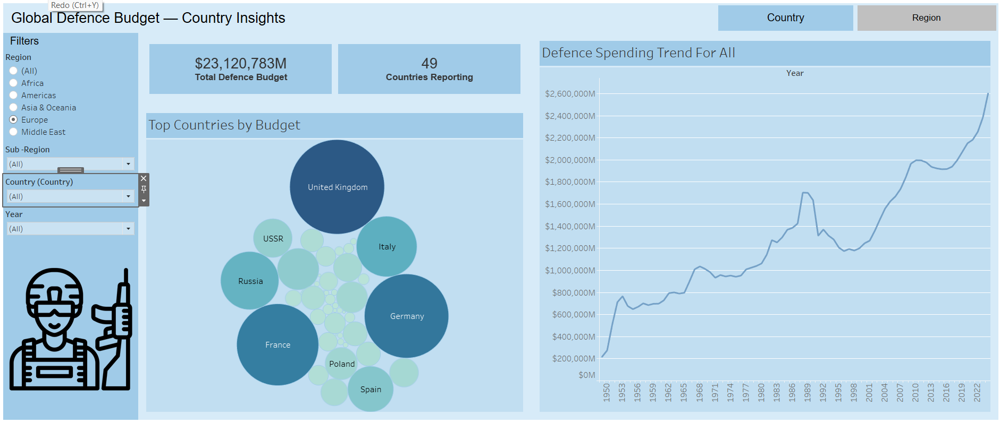
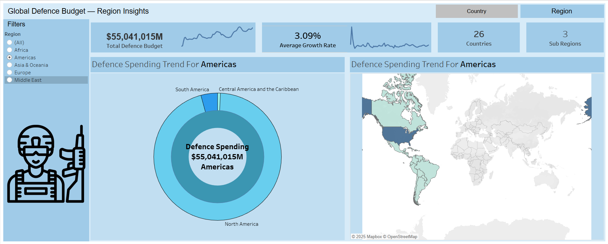

# 🌐 Defence Budget Dashboard (Tableau)

A sleek, interactive Tableau dashboard that analyzes global defence budgets by country, region, and sub-region over multiple years. Designed for **data-driven storytelling**, this project visualizes year-over-year budget growth, regional comparisons, and strategic insights in a modern and intuitive layout.

---

## 📊 Dashboard 1: Country & Region Overview

- 🔍 **Filters**: Region, Sub-Region, Country, Year  
- 📌 **KPIs**:
  - Total Defence Budget ($M)
  - Avg. Year-over-Year Growth (%)
  - Number of Countries
- 📈 **Visuals**:
  - Top Spending Countries (Bar Chart)
  - Yearly Growth Trend (Line Chart)

---

## 🌍 Dashboard 2: Regional Insights

- 🔍 **Filter**: Region  
- 📌 **KPIs**:
  - Total Regional Budget
  - Regional Avg. Growth (%)
  - Number of Sub-Regions
- 🥧 **Visuals**:
  - Sub-Region Budget Distribution (Sunburst Chart)
  - Regional Trend Over Time (Map)

---

## 💡 Features

- 🎯 **Dynamic Filters**: Region → Sub-Region → Country
- 🧮 **Calculated Fields**: For YoY % Growth and KPIs
- 📊 **Visual Variety**: Bar, Line, Donut, and Map
- 🎨 **Modern UI**: Clean layout with custom color palette

---

## 🧰 Tools Used

| Tool     | Purpose                |
|----------|------------------------|
| Tableau  | Dashboard development  |
| Excel    | Data cleaning & prep   |
| GitHub   | Version control        |

---

## 🔗 Live Dashboards

- 📊 Tableau Public: [View Dashboard](https://public.tableau.com/views/DEFENCEBUDGET_17486941225720/RegionInsights_1?:language=en)

